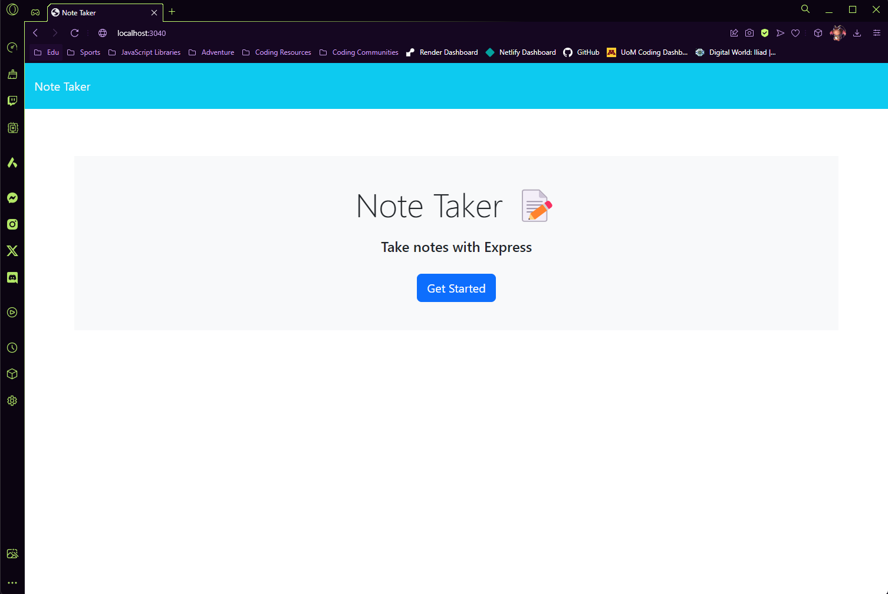
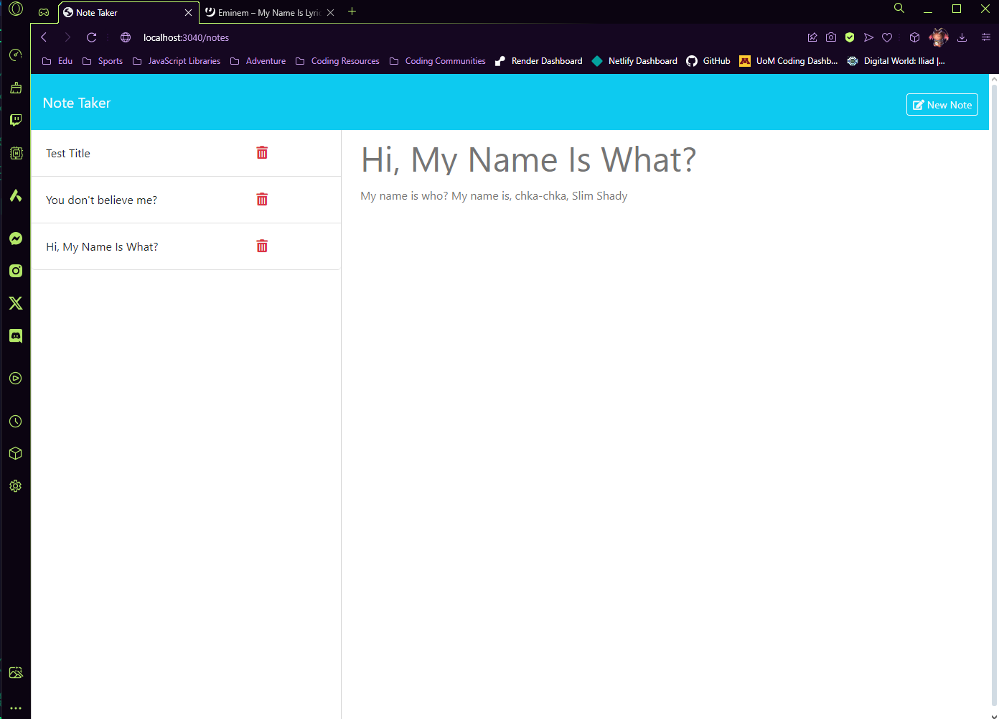

# 11 Express.js: Note Taker

## The Challenge: 

Your assignment is to modify starter code to create an application called Note Taker that can be used to write and save notes. This application will use an Express.js back end and will save and retrieve note data from a JSON file.

The application’s front end has already been created. It's your job to build the back end, connect the two, and then deploy the entire application to Render.

## Project Conduction:

As a small business owner, I want to be able to write and save notes in an application as it will help me organize my thoughts and keep track of tasks I need to complete.

## Acceptance Criteria:
- When the user opens the Note Taker they are presented with a landing page with a link to a notes page.

- When the user clicks on the link to the notes page, they are presented with a page with existing notes listed in the left-hand column.
  - with empty fields to enter a new note title and the note’s text in the right-hand column.

- When the user enters a new note title and the note’s text, they are presented with a "Save Note" button and a "Clear Form" button appear in the navigation at the top of the page.

- When the user clicks on the Save button, the new note they have entered is saved and appears in the left-hand column with the other existing notes and the buttons in the navigation disappear.

- When the user clicks on an existing note in the list in the left-hand column, that note appears in the right-hand column and a "New Note" button appears in the navigation.

- When the user clicks on the "New Note" button in the navigation at the top of the page, they are presented with empty fields to enter a new note title and the note’s text in the right-hand column and the button disappears.

### The Short List:
- The following HTML routes should be created:
  - `GET /notes` should return the `notes.html` file.
  - `GET *` should return the `index.html` file.

- The following API routes should be created:
  - `GET /api/notes` should read the `db.json` file and return all saved notes as JSON.
  - `POST /api/notes` should receive a new note to save on the request body, add it to the `db.json` file, and then return the new note to the client. 
  - Each note will create a unique id when it's saved: NPM Package used: uniqid
  - `DELETE /api/notes/:id` should receive a query parameter that contains the id of a note to delete. 
    - To delete a note, you'll need to read all notes from the `db.json` file, remove the note with the given `id` property, and then rewrite the notes to the `db.json` file.

- Application front end must connect to an Express.js back end.

- Application back end must store notes that have a unique id in a JSON file.

- Application allows users to delete notes.

## Mock-Up:

The following screenshots shows the web application's appearance:

The Landing Page: 

The Note Page: 

## The Deployment:

The Repository: [Click Here.](https://github.com/NovaLanceBrittany/HW-11-Note-Taker)

The Render: [Click Here.](https://hw-11-note-taker.onrender.com/notes)

